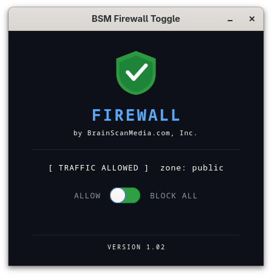
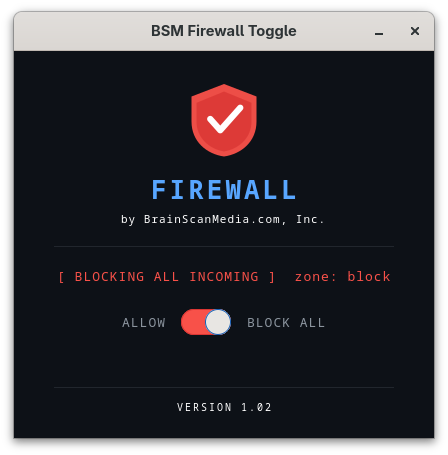

# BSM Firewall Toggle

A simple, clean GTK4 Python firewall toggle app for Fedora Linux — built as a free alternative to GUFW, which is not available in Fedora's package repositories.

One switch. Block all incoming traffic, or allow it. That's it.

> **Note:** This app was developed and tested on **Fedora Linux only**. It has not been tested on any other distributions. Use on other distros is at your own risk.

---

## Screenshots

| Traffic Allowed | Blocking All Incoming |
|---|---|
|  |  |

---

## Features

- One-switch toggle to block or allow all incoming traffic
- Green shield when traffic is allowed, red shield when blocking
- Uses `firewalld` under the hood (native Fedora firewall daemon)
- Single password prompt via `pkexec` (polkit) — no terminal needed
- Automatically moves all active network interfaces to the correct zone
- Runs `firewall-cmd --reload` after every toggle to ensure changes take effect
- Dark tech-themed UI built with GTK4
- Firewall state resets to `public` zone on reboot (runtime-only changes — safe by design)

---

## Requirements

- Fedora Linux (tested on Fedora 44)
- Python 3
- GTK4 Python bindings (`python3-gobject`)
- `firewalld` (installed and running by default on Fedora)
- `librsvg` (for SVG shield rendering)

---

## Installation

### 1. Install dependencies

```bash
sudo dnf install python3-gobject gtk4 librsvg2
```

### 2. Download the script

```bash
curl -O https://raw.githubusercontent.com/BrainScanMedia/BSM-Firewall-Toggle/main/bsm_firewall_toggle.py
chmod +x bsm_firewall_toggle.py
```

### 3. Run it

**Option A — Terminal:**
```bash
python3 bsm_firewall_toggle.py
```

**Option B — Right-click in your file manager:**
1. Right-click `bsm_firewall_toggle.py` in Nautilus (Files)
2. Choose **Properties** → **Executable as Program** (toggle on)
3. Close Properties
4. Double-click the file, then choose **Run** when prompted

This lets you launch it like any other app without opening a terminal.

---

## Optional: Add to GNOME App Menu

To make it launchable from GNOME like a regular app:

```bash
# Copy script to system bin
sudo cp bsm_firewall_toggle.py /usr/local/bin/bsm_firewall_toggle.py
sudo chmod +x /usr/local/bin/bsm_firewall_toggle.py

# Create desktop entry
sudo tee /usr/share/applications/bsm-firewall-toggle.desktop > /dev/null <<DESK
[Desktop Entry]
Name=BSM Firewall Toggle
Comment=Simple one-switch firewall control
Exec=/usr/local/bin/bsm_firewall_toggle.py
Icon=security-high
Terminal=false
Type=Application
Categories=System;Security;Network;
Keywords=firewall;security;block;network;
DESK

sudo update-desktop-database /usr/share/applications/
```

Then search for **BSM Firewall Toggle** in your GNOME app menu.

---

## How It Works

The app uses `firewall-cmd` to manage Fedora's built-in `firewalld` service.

When you **Block All**:
1. Sets the default zone to `block`
2. Moves all active network interfaces into the `block` zone
3. Reloads firewalld

When you **Allow**:
1. Sets the default zone to `public`
2. Moves all active network interfaces back to `public`
3. Reloads firewalld

All privileged commands are batched into a single shell script and executed with one `pkexec` call — so you only see **one password prompt** per toggle.

> **Note:** Changes are runtime-only. On reboot, firewalld returns to its saved configuration (public zone). This is intentional — you can't accidentally lock yourself out permanently.

---

## Developer

**BrainScanMedia.com, Inc.** — [https://www.brainscanmedia.com](https://www.brainscanmedia.com)

Parker, Colorado

---

## Contributing

Pull requests welcome! If you find a bug or want to add a feature, open an issue or submit a PR.

---

## License

MIT License — free to use, modify, and distribute.
See [LICENSE](LICENSE) for full text.
